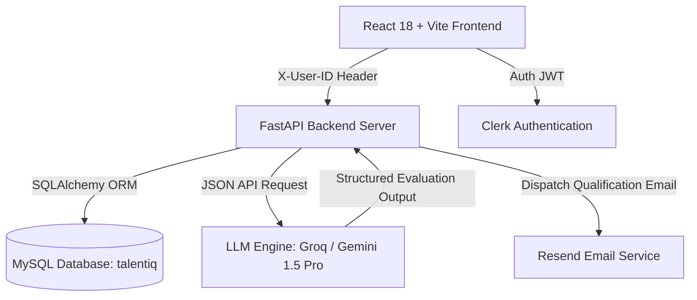

<div align="center">

# 💎 TalentIQ AI — Enterprise Recruiter OS

### *Next-Gen Generative AI Candidate Screening & Workflow Intelligence Platform*

[](https://github.com/prashanthanugathala-spec/ThinkIQ)
[](https://github.com/prashanthanugathala-spec/ThinkIQ)
[](https://github.com/prashanthanugathala-spec/ThinkIQ)
[](https://github.com/prashanthanugathala-spec/ThinkIQ)
[](https://github.com/prashanthanugathala-spec/ThinkIQ)
[](https://github.com/prashanthanugathala-spec/ThinkIQ)
[](https://github.com/prashanthanugathala-spec/ThinkIQ)

</div>

---

## 📌 Executive Summary

**TalentIQ AI** is an enterprise-grade recruitment intelligence platform engineered specifically for **Enterprise Recruiters and Talent Acquisition Leaders**. Inspired by **Apple’s design aesthetics** and powered by **Generative AI**, TalentIQ AI eliminates manual resume screening by automatically parsing applicant PDF resumes, calculating objective **0–100% skill match scores**, identifying missing skill gaps, generating targeted technical interview questions, and dispatching automated shortlist qualification emails via Resend.

---

## 🎯 Problem vs. TalentIQ Solution

| Modern Recruitment Bottlenecks | ⚡ TalentIQ AI Solution |
|---|---|
| **Manual Resume Overload**: Recruiters spend 6–10 hours per job posting skimming resumes manually. | **Instant AI Parsing**: Evaluates candidate resumes against job parameters in seconds (<2s). |
| **Subjective Hiring Bias**: Unstructured evaluation leads to inconsistent candidate selections. | **0–100% Objective AI Scoring**: Mathematical match scoring based on target competency vectors. |
| **Skill Gap Uncertainty**: Hard to identify missing core technical skills prior to interviews. | **Skill Gap Matrix**: Extracts matched skills and flags missing qualifications explicitly. |
| **Unprepared Interviewers**: Generic interview questions fail to probe candidate weaknesses. | **Personalized Questions**: Auto-generates 5–10 tailored technical questions per applicant. |
| **Delayed Communication**: Qualified candidates drop off due to slow feedback loops. | **Automated Email Notifications**: Instant Resend qualification emails upon shortlisting. |

---

## ✨ Key Platform Innovations

### 🍏 1. Apple White Design System
- Built with a clean, high-converting **Apple Light Mode** (`bg-slate-50`, `#0071e3` Apple Blue action pills, frosted glassmorphic cards, and smooth scroll entrance keyframes).

### 🤖 2. Generative AI Evaluation Engine
- Leverages LLM API endpoints (Groq Llama 3.3 70B & Google Gemini 1.5 Pro) to analyze raw resume text against Job Descriptions.
- Automatically generates executive summary verdicts, matched skill tags, missing competency badges, and role-specific interview questions.

### 🏢 3. Multi-Tenant Organization Data Isolation
- Enforces strict user-level data isolation (`created_by == user_id`).
- New recruiters sign up to a **clean slate workspace** with friendly empty state cards.
- Recruiter account details (`clerk_id`, `email`, `first_name`, `last_name`) are automatically synchronized to MySQL database `talentiq` upon sign-in.

### ✏️ 4. Dynamic Job Description Management & Editing
- Full CRUD capabilities for Job Descriptions (`PUT /api/jobs/{id}`).
- Interactive slide-over modal for creating and updating required skills and role descriptions.

### 📧 5. Resend Automated Shortlist Email Dispatch
- Whenever a candidate is marked as **Shortlisted** or achieves a high AI Match Score (**>= 85%**), TalentIQ automatically dispatches a branded HTML qualification email to the candidate.

### 🔍 6. Optimized Global Search Engine (`⌘K` / `Ctrl+K`)
- Press `⌘K` or `Ctrl+K` anywhere to open an instant search dropdown modal.
- Performs real-time fuzzy matching across candidates, job openings, and skills.

---

## 🏗️ System Architecture



---

## 📂 Repository Architecture

```
TalentIQ-AI/
├── backend/
│   ├── app/
│   │   ├── api/          # FastAPI REST Endpoints (jobs, candidates, dashboard, users)
│   │   ├── core/         # Environment Config & Database Settings
│   │   ├── db/           # SQLAlchemy Engine, Session, & Seed Engine
│   │   ├── models/       # ORM Database Models (Job, Candidate, User)
│   │   ├── schemas/      # Pydantic Schemas
│   │   ├── services/     # AI Engine, PyPDF2 Parser, Resend Email Service
│   │   └── main.py       # FastAPI Application Entrypoint
│   ├── requirements.txt
│   └── .env.example
├── frontend/
│   ├── src/
│   │   ├── components/   # Common GlassCards, ScoreGauge, Navbar, Sidebar
│   │   ├── pages/        # Landing, Dashboard, Jobs, UploadResume, Analysis, Candidates, Compare
│   │   ├── services/     # Axios API Client & User Isolation Interceptor
│   │   └── styles/       # Apple Light Mode CSS System & Animations
│   ├── package.json
│   ├── vite.config.js
│   └── .env.example
├── .gitignore
└── README.md
```

---

## ⚡ Quickstart & Local Installation Guide

### 1. Prerequisites
- **Python 3.10+**
- **Node.js 18+**
- **MySQL 8.0 Server** (running on `localhost:3306`)

### 2. Backend Setup
```bash
cd backend
python -m venv venv

# Activate Virtual Environment:
# Windows PowerShell:
venv\Scripts\activate
# Linux / macOS:
source venv/bin/activate

pip install -r requirements.txt
cp .env.example .env
# Configure MYSQL_USER, MYSQL_PASSWORD, GEMINI_API_KEY, and RESEND_API_KEY in .env

python -m uvicorn app.main:app --host 127.0.0.1 --port 8000 --reload
```

### 3. Frontend Setup
```bash
cd frontend
npm install
cp .env.example .env.local
# Configure VITE_CLERK_PUBLISHABLE_KEY in .env.local

npm run dev -- --host 127.0.0.1 --port 3000
```

---

## 🌐 Localhost Access Links

- **React Vite Frontend App**: [http://localhost:3000](http://localhost:3000)
- **FastAPI REST Service**: [http://127.0.0.1:8000](http://127.0.0.1:8000)
- **Interactive Swagger API Docs**: [http://127.0.0.1:8000/docs](http://127.0.0.1:8000/docs)

---

<div align="center">

### 🏆 Crafted with Precision for Hackathons & Enterprise Talent Acquisition

*Built with Python FastAPI, MySQL, React 18, Clerk, Groq/Gemini AI & Resend API*

</div>
