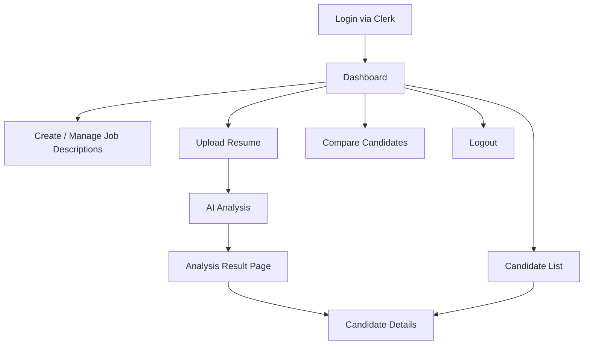

# TalentIQ AI
## Product Requirements Document (PRD)
## Technical Requirements Document (TRD)
## Application Flow

**Version:** 1.1  
**Date:** August 2026  
**Status:** Final Draft

---

# 1. Product Requirements Document (PRD)

### 1.1 Overview
TalentIQ AI is an AI-powered recruitment platform that helps recruiters:

- Upload Job Descriptions (JDs)
- Upload candidate resumes
- Analyze resumes using AI
- Calculate candidate-job match scores
- Identify missing skills
- Generate personalized interview questions
- Compare candidates on a dashboard
- Make faster, data-driven hiring decisions

The platform provides a modern HR dashboard with secure authentication, resume parsing, skill-gap analysis, and AI-assisted insights.

### 1.2 Goals & Objectives

**Primary Goals**
- Reduce time-to-hire by automating resume screening and interview preparation.
- Improve hiring quality through objective match scores and skill-gap insights.
- Provide a clean, modern interface for recruiters to manage jobs, candidates, and AI analysis results.

**Success Metrics**
- Average time from resume upload to match score < 30–60 seconds.
- High relevance of generated interview questions (validated by recruiter feedback).
- Intuitive navigation with minimal clicks to complete core tasks.
- Secure handling of candidate personal data.

### 1.3 Target Users
- **Primary:** Recruiters / Talent Acquisition specialists
- **Secondary (future):** Hiring managers (view-only or limited access)

### 1.4 Core Features

| Feature                        | Description |
|--------------------------------|-------------|
| Authentication                 | Secure login/signup powered by Clerk |
| Dashboard                      | Hiring statistics, charts, quick actions |
| Job Description Management     | Create, view, edit, and delete Job Descriptions |
| Resume Upload                  | Upload PDF resumes linked to a selected JD |
| AI Resume Analysis             | Parse resume → Match Score + Missing Skills + Interview Questions |
| Candidate List & Details       | Browse candidates and view individual detailed profiles |
| Candidate Comparison           | Side-by-side comparison of multiple candidates for the same job |
| Email Notifications            | Confirmation and status emails via Resend |
| Modern UI                      | Persistent Sidebar + Navbar + responsive layout |

### 1.5 User Flows (High-Level)
1. Login → Clerk authentication → Dashboard
2. Create JD → Fill form → Save → View in JD list
3. Upload Resume → Select JD → Upload PDF → AI analysis triggered
4. View Analysis → Match score + missing skills + interview questions
5. Candidate List / Details → Browse candidates → Open detailed view
6. Compare Candidates → Select multiple candidates for a job → View comparison

### 1.6 Out of Scope (MVP)
- Candidate self-service portal
- Video interview integration
- Advanced ranking algorithms beyond AI-based scoring
- Multi-language resume support (initially English focus)
- Full ATS replacement features (offer letters, background checks, etc.)
- Mobile native apps
- Multi-tenant organization / team management

### 1.7 Assumptions & Dependencies
- Google Gemini API (or chosen LLM) is available with sufficient quota.
- Clerk and Resend accounts are properly configured.
- PDF resumes are reasonably well-formatted for text extraction.
- Internet connectivity is required for AI and email services.

### 1.8 Future Enhancements (Post-MVP)
- Team / organization multi-user support
- Advanced filtering and search on candidates
- Exportable reports (PDF / CSV)
- Custom scoring weights
- Integration with LinkedIn or other job boards
- Automated email sequences via Resend

---

# 2. Technical Requirements Document (TRD)

### 2.1 Tech Stack

| Layer              | Technology                                      |
|--------------------|-------------------------------------------------|
| Frontend           | React, React Router, Axios, Bootstrap, Chart.js |
| Authentication     | Clerk (React SDK)                               |
| Backend            | Python (FastAPI recommended)                    |
| Database           | MySQL                                           |
| AI                 | Google Gemini API                               |
| Email              | Resend                                          |
| File Storage       | Local filesystem or Cloud Object Storage        |
| Version Control    | Git + GitHub                                    |

### 2.2 High-Level Architecture

```
┌─────────────────────┐
│   React Frontend    │
│  (Clerk Auth SDK)   │
└──────────┬──────────┘
           │ REST APIs (JWT)
           ▼
┌─────────────────────┐
│  FastAPI Backend    │
└────┬───────┬────┬───┘
     │       │    │
     ▼       ▼    ▼
  MySQL   Gemini  Resend
          API     Email
     │
     ▼
 File Storage
 (Resumes)
```

### 2.3 Database Schema (Core Tables)

#### `job_descriptions`
| Column            | Type          | Notes                          |
|-------------------|---------------|--------------------------------|
| id                | INT (PK)      | Auto-increment                 |
| title             | VARCHAR(255)  | Job title                     |
| description       | TEXT          | Full JD text                   |
| required_skills   | JSON / TEXT   | List of required skills        |
| experience_level  | VARCHAR(50)   | e.g. Junior / Mid / Senior     |
| location          | VARCHAR(255)  | Optional                       |
| created_by        | VARCHAR(255)  | Clerk user_id                  |
| created_at        | DATETIME      |                                |
| updated_at        | DATETIME      |                                |

#### `candidates`
| Column               | Type          | Notes                              |
|----------------------|---------------|------------------------------------|
| id                   | INT (PK)      | Auto-increment                     |
| job_id               | INT (FK)      | References job_descriptions.id     |
| name                 | VARCHAR(255)  | Extracted or entered               |
| email                | VARCHAR(255)  | Optional                           |
| phone                | VARCHAR(50)   | Optional                           |
| resume_file_path     | VARCHAR(500)  | Path to stored PDF                 |
| parsed_data          | JSON          | Full extracted profile             |
| match_score          | FLOAT         | 0–100                              |
| missing_skills       | JSON          | List of missing skills             |
| interview_questions  | JSON          | Generated questions                |
| status               | VARCHAR(50)   | e.g. Pending / Analyzed / Shortlisted |
| created_at           | DATETIME      |                                    |
| updated_at           | DATETIME      |                                    |

> **Note:** User identity is primarily managed by Clerk. A lightweight `users` mapping table can be added if additional application-specific user data is required.

### 2.4 Key API Endpoints (Backend)

| Method | Endpoint                        | Description                              | Auth Required |
|--------|---------------------------------|------------------------------------------|---------------|
| GET    | /api/jobs                       | List all job descriptions                | Yes           |
| POST   | /api/jobs                       | Create a new job description             | Yes           |
| GET    | /api/jobs/{id}                  | Get a specific job description           | Yes           |
| PUT    | /api/jobs/{id}                  | Update a job description                 | Yes           |
| DELETE | /api/jobs/{id}                  | Delete a job description                 | Yes           |
| POST   | /api/resumes/upload             | Upload resume + trigger AI analysis      | Yes           |
| GET    | /api/candidates                 | List candidates (optional job filter)    | Yes           |
| GET    | /api/candidates/{id}            | Get candidate details + analysis         | Yes           |
| POST   | /api/candidates/compare         | Compare multiple candidates              | Yes           |
| GET    | /api/dashboard/stats            | Dashboard statistics & charts data       | Yes           |

All protected endpoints must validate the Clerk JWT.

### 2.5 AI Processing Flow
1. Receive PDF resume via upload endpoint.
2. Save file to storage and create initial candidate record.
3. Extract text from PDF using a library (e.g. `pdfplumber`, `PyMuPDF`, or `PyPDF2`).
4. Construct a structured prompt containing the JD and resume text.
5. Call Google Gemini API to:
   - Extract structured candidate profile
   - Calculate match score (0–100)
   - Identify missing skills
   - Generate 5–10 personalized interview questions
6. Update the candidate record in MySQL with the AI results.
7. Optionally trigger a confirmation email via Resend.
8. Return the analysis payload to the frontend.

### 2.6 Security Requirements
- All application routes protected by Clerk authentication.
- Resume files stored with restricted access.
- API keys (Gemini, Resend, database credentials) stored in environment variables.
- Strict file type validation (PDF only) and size limits.
- Input validation and sanitization on all endpoints.
- Proper CORS configuration.
- No sensitive personal data written to application logs.

### 2.7 Non-Functional Requirements
- **Performance:** AI analysis should complete within 30–60 seconds under normal conditions.
- **Usability:** Responsive design (desktop-first, mobile-friendly).
- **Reliability:** Graceful handling of parsing failures, AI timeouts, and network errors.
- **Scalability:** Architecture should support future multi-user / team features.
- **Privacy:** Candidate PII handled with care; follow data-minimization principles.

### 2.8 Environment Configuration (Secrets)

**Important Security Rule:**  
Never commit real API keys, passwords, or secrets to Git, documentation, or shared files.  
All secrets must be stored in a `.env` file (and the `.env` file must be added to `.gitignore`).

#### Required Environment Variables

**Frontend (`.env` in React project)**
```env
VITE_CLERK_PUBLISHABLE_KEY=pk_test_xxxxxxxxxxxxxxxxxxxxxxxxxxxxx
```

**Backend (`.env` in Python project)**
```env
# Clerk
CLERK_SECRET_KEY=sk_test_xxxxxxxxxxxxxxxxxxxxxxxxxxxxx

# Resend
RESEND_API_KEY=re_xxxxxxxxxxxxxxxxxxxxxxxxxxxxx

# LLM (Gemini / Groq / other)
LLM_API_KEY=gsk_xxxxxxxxxxxxxxxxxxxxxxxxxxxxx
# or GEMINI_API_KEY=AIzaSyxxxxxxxxxxxxxxxxxxxxxxxxxxx

# MySQL
MYSQL_HOST=localhost
MYSQL_PORT=3306
MYSQL_USER=root
MYSQL_PASSWORD=your_mysql_password_here
MYSQL_DATABASE=talentiq
```

> **Note:** Replace the placeholder values above with your actual keys only inside the local `.env` files.  
> Do **not** put real keys in this PRD, README, or any file that is committed to the repository.

---

# 3. Application Flow

### 3.1 High-Level User Journey

```
Login (Clerk)
      ↓
Dashboard
      ├── Create / Manage Job Descriptions
      ├── Upload Resume (select JD)
      │         ↓
      │   AI Analysis (Match Score + Missing Skills + Interview Questions)
      │         ↓
      │   Analysis Result / Candidate Details
      ├── Candidate List
      ├── Candidate Comparison
      └── Logout
```

### 3.2 Detailed Page Flow

1. **Login Page**
   - Clerk Sign-in / Sign-up components
   - On success → redirect to Dashboard

2. **Dashboard**
   - Summary cards: Total Jobs, Total Candidates, Average Match Score, Recent Activity
   - Charts (using Chart.js)
   - Quick action buttons: “Create JD”, “Upload Resume”
   - Recent candidates preview

3. **Persistent Layout**
   - **Sidebar:** Dashboard, Jobs, Candidates, Upload Resume, Compare
   - **Navbar:** Logo, user avatar / name, Logout (Clerk)

4. **Job Description Pages**
   - List view with Create / Edit / Delete actions
   - Form fields: Title, Description, Required Skills, Experience Level, Location

5. **Upload Resume Page**
   - Dropdown to select an existing Job Description
   - File upload component (drag-and-drop or click) – PDF only
   - Submit → Backend processes file → Redirect to Analysis Result page

6. **AI Analysis Result Page**
   - Candidate basic information
   - Large visual Match Score indicator
   - Missing Skills displayed as tags / list
   - Numbered list of generated Interview Questions
   - Actions: View Full Profile, Add to Comparison, Back to Candidates

7. **Candidate List**
   - Filterable by Job
   - Table or card view showing Name, Match Score, Status, Upload Date
   - Click row/card → Candidate Details

8. **Candidate Details**
   - Full parsed profile + complete AI analysis
   - Option to download original resume (if permitted)

9. **Candidate Comparison**
   - Select a Job → Choose 2–4 candidates
   - Side-by-side comparison cards (scores, skills present/missing, key highlights)

### 3.3 Sequence – Resume Upload & Analysis

```
User                Frontend                 Backend                  External Services
 │                     │                        │                            │
 │── Upload Resume ───▶│                        │                            │
 │                     │── POST /resumes/upload ▶│                            │
 │                     │                        │── Save file ──────────────▶│ File Storage
 │                     │                        │── Parse PDF                │
 │                     │                        │── Call Gemini API ────────▶│ Gemini
 │                     │                        │◀─ Analysis result ─────────│
 │                     │                        │── Update MySQL             │
 │                     │                        │── (Optional) Send email ──▶│ Resend
 │                     │◀── Analysis payload ───│                            │
 │◀── Redirect to Result Page                  │                            │
```

### 3.4 Mermaid Diagram – Main Application Flow



---

**End of Document**

*This Markdown file contains the complete Product Requirements Document (PRD), Technical Requirements Document (TRD), and Application Flow for TalentIQ AI.*
